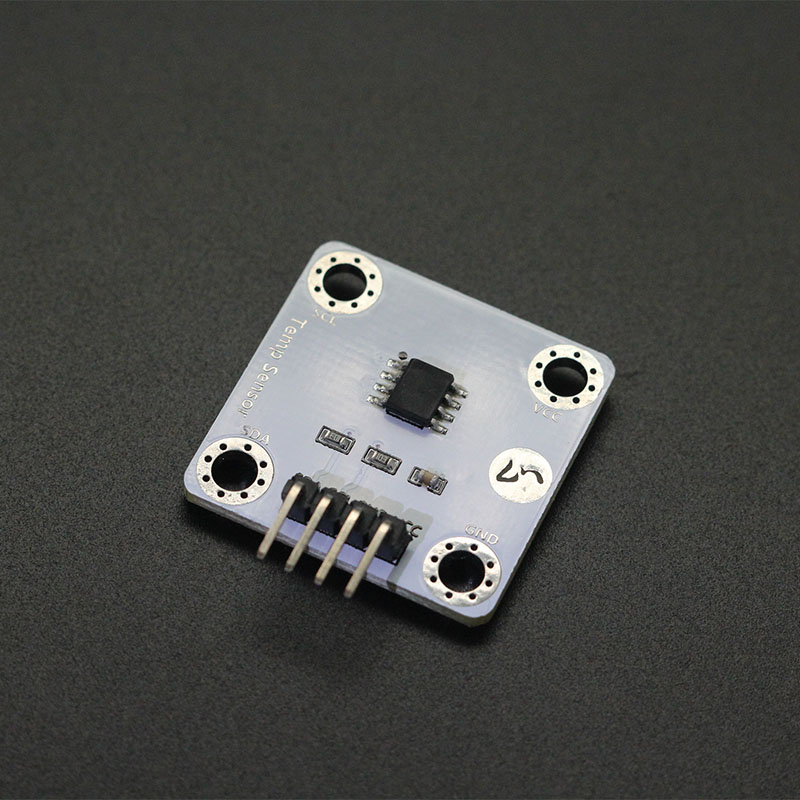
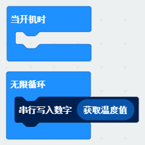

# Xindkj Tempature Sensor

makecode xindkj tempature sensor module extension for micro:bit.  

Part of the drive base on fizban99's microbit OLED driver:  
https://github.com/fizban99/microbit_ssd1306  

Author: lz
Date:   2020.Mar  

  
  

## Add extension

open your microbit makecode project, in Extension, paste  

https://github.com/zl05101/pxt-LM75A

to search box then search, and click to add.  

## Basic usage

```
basic.forever(function () {
    serial.writeNumber(LM75A.getTemperatureInDegrees())
})
```

## API

- **getTemperatureInDegrees()**  
get current tempature

## Demo

  


## License

MIT

Copyright (c) 2018, microbit/micropython Chinese community  

## Supported targets

* for PXT/microbit


[From microbit/micropython Chinese community](http://www.micropython.org.cn)
